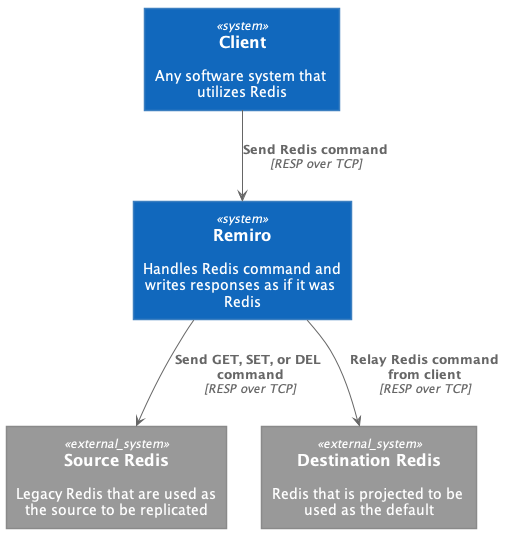
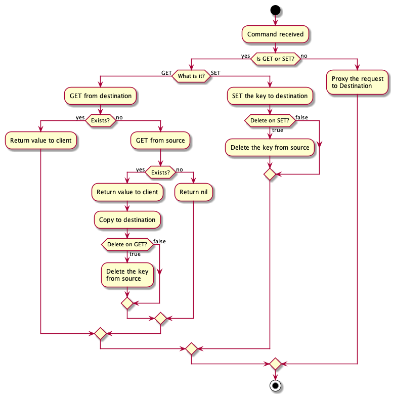

# Remiro

[](https://travis-ci.com/tiket-oss/remiro)
[](https://codecov.io/gh/tiket-oss/remiro)

Remiro is a service that serves as a proxy in front of multiple Redis servers.

## Rationale

Suppose you have a single Redis server, it holds various types of data throughout your system, and you decided to move a group of similar types of data into a new Redis server. Problem is, you didn't have any convention of naming the key to indicate its type.

There are of course multiple solutions which can be done with existing tools:

1. Duplicate the Redis server and then have the system use different servers based on their cases.
2. Create a new empty Redis server, and have the system populate it over time.

The drawback of such an approach is that you don't have a clean distribution of data. Approach number 1 will clutter both Redis server with unneeded data since we can't assume that the data has expiration deadline set, and approach number 2 will hamper the performance of the running system that should use the new Redis server, since then it will have to look up the keys which will be non-existent, and then populate it with the new value that is derived from somewhere else.

### Solution

Remiro can act as an intermediary for populating the new Redis server over time without sacrificing the system that still needs the data. It works by these following assumption:

- There are two sets of Redis server, the **source** and the **destination**
- Suppose **source** Redis has two sets of data: the **data to keep** and the **data to move**
- We want to move **data to move** from **source** to **destination** while ignoring the **data to keep**
- *IMPORTANT*: The system that will request through Remiro is the one that *only* needs the **data to move**

The assumption can be represented by the following diagram



With the assumption in place, we can establish a mechanism in which Remiro will adhere to:

- If the retrieval request came through Remiro:
  - Remiro will check whether the data exists on **destination**
    - If exists:
      - Remiro will return the data from **destination** to the requester, *process ends*
    - If not exists, *process continues*
  - Remiro will check the data existence in **source**
    - If exists:
      - Remiro will return the data from **source** to the requester
      - Remiro will copy the data from **source** to **destination**
      - (optional) Remiro will delete the data from **source**
      - *process ends*
    - If not exists, Remiro *returns* any response that it gets from **source**
- If assignment request came through remiro:
  - Remiro will write the data to **destination**
  - (optional) Remiro will delete the data with the same key from **source**
- If any other request came through remiro:
  - Simply proxy the request to the **destination**



## How to use

To run Remiro, provide the host, port, and configuration file path via flag:

```sh
remiro -h 127.0.0.1 -p 6379 -c config.toml
```

Configuration is supported via TOML format and has these following fields to adjust:

```toml
# Determine whether to delete requested key from "source" Redis
# on successful GET command
DeleteOnGet = true

# Determine whether to delete requested key from "source" Redis
# on successful SET command
DeleteOnSet = false

# If set, any connection to Remiro must be authenticated first
# by matching the password in AUTH <password> command
Password = "foobared"

# Client configuration for "source" redis
[Source]

# Redis address
Addr = "redis-source:6379"

# Password to use when connecting to Redis server
Password = "foobared"

# Connection pooling: determine how many maximum idle connections
# to allow
MaxIdleConns = 50

# Connection pooling: determine how long a connection can be kept in
# idle state before being closed. Format is based on golang ParseDuration
# format: https://golang.org/pkg/time/#ParseDuration
IdleTimeout = "30s"

# Client configuration for "destination" redis
[Destination]

# Redis address
Addr = "redis-destination:6379"

# Password to use when connecting to Redis server
Password = "foobared"

# Connection pooling: determine how many maximum idle connections
# to allow
MaxIdleConns = 100

# Connection pooling: determine how long a connection can be kept in
# idle state before being closed. Format is based on golang ParseDuration
# format: https://golang.org/pkg/time/#ParseDuration
IdleTimeout = "45s"
```

## Instrumentation

Remiro supports some instrumentation metrics that are useful to gauge Redis usage:

| Metrics                | Description                                                 | Unit  |
| ---------------------- | ----------------------------------------------------------- | ----- |
| remiro_command_count   | The count of outgoing request to supporting Redis instances | count |
| remiro_request_latency | Time it took to serve a request through Remiro              | ms    |

The instrumentation is compatible with Prometheus only and is accessible by scrapping the `/metrics` endpoint.

To set a specific port for instrumentation capability you can use the `-i` flag, otherwise, it defaults to `:8888`

```sh
remiro -h 127.0.0.1 -p 6379 -c config.toml -i 9000
```

### Health check

An endpoint for observing server health is available at `/health` endpoint. Aside from the standard "200 if server is healthy, 500 otherwise", it also returns a JSON response containing information of individual Redis server status:

```json
{
  "destinationRedis": {
    "status": "OK"
  },
  "sourceRedis": {
    "status": "Error",
    "error": "Error message sent from source redis"
  }
}
```
